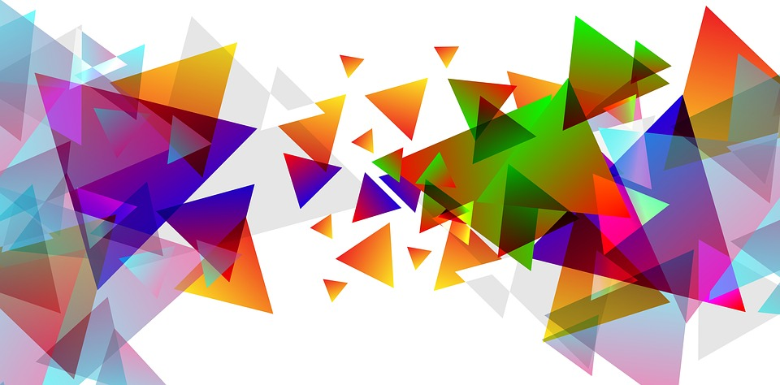

# 5 | Princípios de design gráfico

Há muitas formas possíveis de se dizer o que se quer...
Nem todas utilizam palavras [Bonnici, 2001]



E agora, depois de estudarmos sobre design instrucional e conhecermos elementos dos materiais didáticos e depois de aprendermos sobre estratégias de dinamização de conteúdo tais como a roteirização, o storytelling e a gamificação, chegamos ao "Design Gráfico"! E por que abordaremos este tema? Porque como diria Steve Jobs (um dos grandes designers da nossa época):

> No vocabulário da maioria das pessoas, design significa "verniz". É a decoração de interiores. É o tecido das cortinas do sofá. Mas para mim, nada poderia estar mais longe do significado do design. O design é a alma fundamental de uma criação feita pelo homem que acaba expressando-se em sucessivas camadas externas do produto ou serviço.
> Fonte: *Artigo da revista "Fortune", intitulado "Apple's One-Dollar-a-Year Man" sobre Steve Jobs, publicado em 24 de janeiro de 2000.*

Quando Steve Jobs afirma o exposto acima, corrobora com o designer gráfico japonês Ikko Tanaka que, ao definir o "Design Gráfico" explica que trata-se de uma capacidade de criar algo enxuto a partir de várias considerações, tirando o excedente e filtrando o essencial, alcançando seu objetivo no momento que consegue traduzir o desejo do cliente e a interação completa do receptor.  Ficou mais claro? Talvez não, não é mesmo? Ainda estamos numa linha muito poética. Vamos ser mais práticos...Assista o vídeo a seguir, de autoria de Matheus Moura e sua equipe, que traz, de forma bem divertida e talvez pouco humilde, mais informações sobre esse campo do conhecimento.


```{vimeo} 21972483
```

Na realidade de modo simples, podemos dizer que o design gráfico é a **área interdisciplinar, ou seja, que congrega diversas outras áreas do conhecimento para planejar, projetar e executar ideias e experiências com conteúdo visual e textual**. Isso quer dizer que os designers gráficos organizam a tipografia, a forma e a imagem em cartazes, anúncios, pacotes e outros materiais impressos e digitais, bem como visualizações de informações e gráficos para jornais e revistas" (CEZZAR, 2017).  A designer, escritora e professora Juliette Cezzar é quem apresenta esta definição e complementa que:

> A ideia no design gráfico pode ser expressada física ou virtualmente e pode incluir imagens, palavras ou gráficos. A experiência, nesta área, pode ocorrer em um instante ou por um longo período de tempo. O trabalho pode acontecer em qualquer escala, desde a concepção de um único selo postal até um sistema nacional de sinalização postal. Pode ser destinado a um pequeno número de pessoas, como um livro ou exposição de edição única ou limitada, ou pode ser visto por milhões, como o conteúdo digital e físico interligado de uma organização internacional de notícias. Também pode ser para qualquer finalidade, seja comercial, educacional, cultural ou política.

Ainda com base nos textos da professora, podemos dizer que o design gráfico por ser essencialmente visual, é muito confundido com o trabalho dos ilustradores. Contudo, ela explica que: "enquanto um ilustrador cria ou desenha uma imagem em resposta a uma ideia, um designer combina ilustrações, fotografias e tipos para comunicar uma ideia. Uma maneira de entender isso é considerar a diferença entre um fabricante de móveis e um designer de interiores. Um faz um objeto específico para um propósito específico, enquanto o outro pensa em como todos os objetos e superfícies de um ambiente criam um ambiente para a pessoa que se move através dele". (CEZZAR, 2017). E é nesse aspecto que os princípios básicos de design gráfico podem ajudar você!

Vamos fazer um exercício rápido para verificar na prática essa constatação: que tipo de conteúdo chama mais a sua atenção: (a) aquele com blocos enormes de texto e sem nenhuma imagem ou (b) aquele com conteúdo bem distribuído, bem organizado, onde a hierarquia é clara e as ilustrações estão nítidas e com significado claro? Pronto, está aí sua confirmação. É por meio do design gráfico que você conseguirá aumentar o apelo visual do seus conteúdos, se comunicar de forma clara e objetiva, aumentar a motivação de todos aqueles que estiverem, por meio do seu recurso didático, envolvidos no processo de aprendizagem [^1].

Atualmente muitas pessoas escrevem e publicam digitalmente seus textos. E, claro, esperam que seu material seja lido. Os leitores, por sua vez, exigem que os itens importantes estejam claramente apresentados. Eles não se interessarão por um material difícil de ler, mas ficarão satisfeitos com o que tiver uma aparência bem organizada, pois isso facilitará a sua leitura, ainda que o conteúdo seja complexo. Por isso, a parte importante deve ficar em destaque e aquela sem importância deve ser abrandada. Temos aí, uma dos princípios básicos do design gráfico: o contraste! Vamos aprender outros?

```{note}
A seguir, disponibilizamos para você, uma parte do livro "Design para quem não é designer: noções básicas de planejamento visual", escrito por Robin Williams. Como a própria autora lembra o livro não tem a pretensão de formar designers, porém através de uma apresentação simples dos princípios básicos de design, acreditamos que é possível produzir recursos didáticos com uma aparência mais profissional, organizada, unificada e interessante [^2]. E não é isso que queremos? Então siga com a leitura!

[Clique aqui para ler](https://moodle.ead.ifsc.edu.br/pluginfile.php/224604/mod_book/chapter/16221/design_para_quem_nao_e_designer-principios%20basicos-final.pdf)
```

Como você pode ler, o material acima aborda quatro princípios básicos do design: contraste (elementos similares em uma página), repetição (organização), alinhamento (aparência limpa) e proximidade (unidade visual). São princípios que se você seguir enquanto estiver produzindo seus recursos didáticos.

```{admonition} E agora?
**Design é estética?** O Design, principalmente o design gráfico/visual, tem uma relação direta com a estética, com o fato de algo se tornar agradável aos olhos. No entanto, a atenção para estética é apenas uma premissas do bom design. Pense na cadeira que você está sentado(a), por exemplo, ela pode ser agradável aos olhos, mas pode não ser nada confortável. Ou ao contrário, pode ser confortável, mas ser "feia que dói", como dizem. Quando pensamos em design visual e focamos em questões relacionadas à aparência, não estamos indicando que algo deve ser belo apenas com intuito de agradar. No caso de um recurso didático, elementos como contraste, hierarquia de informação, alinhamento e continudade atendem também necessidades físicas, ergonômicas. Já pensou ter que ler um texto com uma fonte muito pequena, sem espaço confortável? Já experienciou alguma imagem que era difícil de ver porque não apresentava contraste? Já pegou um caminho errado porque a sinalização não estava clara? Design vai muito além da estética. É por isso que convidamos você a compartilhar com os colegas achados duvidosos de design. Considerando os princípios que você viu até aqui, poste algo que encontrou (uma peça gráfica, um móvel, um site, um vídeo, etc) que você acredita que poderia ser melhorado. Indique também o que você mudaria, considerando o que estudou.

[Clique aqui e compartilhe designs duvidosos ](https://moodle.ead.ifsc.edu.br/mod/forum/discuss.php?d=72537)
```

Além destes princípios, temos outro elemento visual que, ainda que sempre tenha sido relevante, atualmente, torna-se a cada dia mais disponível: **as imagens!**

Uma imagem vale mais que mil palavras...


Tartaruga-marinha presa por uma rede de pesca: Fotografia 1º lugar na categoria Nature (natureza) no World Press Photo 2017. Acesse mais imagens premiadas em: <http://www.resumofotografico.com/2017/02/veja-as-imagens-premiadas-no-world-press-press-photo-2017.html>. 

Você já ouviu falar que "uma imagem vale mais que mil palavras"? Certamente... Essa é uma expressão popular utilizada para transmitir a ideia do poder da comunicação através das imagens. O significado deste ditado está relacionado com a facilidade em compreender determinada situação a partir do uso de recursos visuais, ou a facilidade de explicar algo com imagens, ao invés de palavras (sejam escritas ou faladas). [^3]

Por isso, é muito importante utilizar imagens para ilustrar ou tangibilizar mais ainda o conteúdo que está sendo apresentado. Isso é primordial para o sucesso da sua estratégia de comunicação com seus leitores, isso vale para suas interações nas redes sociais, e é fundamental para os seus recursos didáticos. É comprovado: textos que possuem imagens recebem 94% mais visualizações, ou seja, utilizando imagens você tem mais chance de atrair mais leitores. Se você estiver se perguntando onde conseguir boas imagens, fique tranquilo, pois existem diversos bancos de imagens gratuitos por aí. Confira acessando esta página (da qual este parágrafo foi extraído) e também onde você encontrará diferentes links para conseguir excelentes imagens: <https://rockcontent.com/guia/design-grafico-o-guia-definitivo/#parte10>.


```{admonition} Aprofunde seus conhecimentos
Ainda está achando dificil construir recursos didáticos e utilizar os princípios do design gráfico? Bom, atualmente há muitos softwares disponíveis que ajudam você a elaborar peças gráficas com uma qualidade quase profissional. Uma dessas plataformas é o "Canva". O Canva consiste numa das ferramentas de criação de conteúdos gráficos mais simples de utilizar e que, ao meu ver, tem muita qualidade gráfica! O Canva é gratuito e online e está disponível em: <https://www.canva.com/pt_br/>. Mais informações você obtém no próprio site, no blog: <http://blog.cleverweb.com.br/canva-o-que-e-e-como-utilizar/> ou ainda assistindo ao vídeo a seguir que apresenta os primeiros passos para utilizar essa ferramenta: 

```{youtube} 3LVBzoaM2f8
```

Ahh... uma última coisa: você sabe como podemos classificar essa ferramenta "Canva"? Podemos classificá-la como uma ferramenta de autoria. Quer saber porque? Continue a leitura.

[^1]: Parágrafo adaptado de: Design gráfico: o guia definitivo: dê destaque aos seus conteúdos. Disponível em: https://rockcontent.com/guia/design-grafico-o-guia-definitivo/#parte10. Acesso em: 25 de junho de 2018. 

[^2]: Resenha do livro adaptada de: Blog do Ben Oliveira.  Disponível em: http://www.benoliveira.com/2013/09/design-para-quem-nao-e-designer-robin.html. Acesso em: 25 de junho de 2018. 

[^3]: Conteúdo extraído de: O significado de Uma imagem vale mais que mil palavras. Disponível em: https://www.significados.com.br/uma-imagem-vale-mais-que-mil-palavras/. Acesso em: 25 de junho de 2018. 