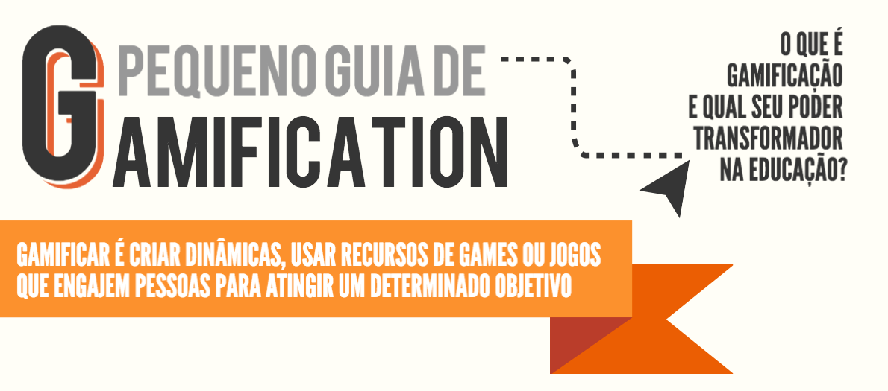

# 4 | Gamificação

Até aqui, você pode conhecer um pouco sobre aspectos importantes das produção de recursos didáticos: conversamos sobre os princípios do design instrucional, os principais elementos dos materiais didáticos, bem como as principais noções de roteirização e do *storytelling*. Muito legal, não é? Mas o mais interessante vem agora, ou seja, chegou a hora de brincarmos um pouco: vamos falar de**gamificação**! Mas você sabe o que este termo significa? Talvez, se nunca leu algo sobre o tema, você poderá imaginar que "gamificar" é utilizar "games" em um determinado contexto, certo? 

<iframe src="https://giphy.com/embed/JuUWDI13JB0XK" width="480" height="276" frameBorder="0" class="giphy-embed" allowFullScreen></iframe><p><a href="https://giphy.com/gifs/disneypixar-disney-pixar-JuUWDI13JB0XK">via GIPHY</a></p>

**Errado!**

```{note} "Você precisa saber"
Gamificação, do inglês *Gamification*, é a prática de aplicar os princípios dos games em outros contextos e áreas diversas, como negócios, saúde e vida social e, porque não, educação! O principal objetivo é aumentar o engajamento e despertar a curiosidade dos usuários. Não é necessário criar um jogo em si, mas somente usar seus fundamentos. Aprenda mais no artigo abaixo de Paulo Vasconcellos (2016).

 [Artigo: O que é Gamificação? Conheça a ciência que traz os jogos para o cotidiano.](https://www.techtudo.com.br/noticias/noticia/2016/07/o-que-e-gamificacao-conheca-ciencia-que-traz-os-jogos-para-o-cotidiano.html)
```

No artigo citado anteriormente, Vasconcellos (2016) faz uma afirmação importante: o autor conclui que a gamificação parte de um princípio bem básico, ou seja, é "uma **constatação sobre como os seres humanos sentem-se atraídos por jogos**". "Sejam eles eletrônicos ou analógicos, a verdade é que a humanidade sempre teve grande engajamento para apreciar e participar de jogos". Você saberia identificar quais foram e diria para gente como foi essa experiência para você? Compartilhe com a turma no fórum! 

Muito bem! Vamos ver se você acertou? Vamos identificar que elementos foram esses? Continue a leitura com o texto de do professor Antônio Miguel Faustini Zarth (2017).

```{note} "Você precisa saber"
Acesse aqui o texto do Prof. Antônio Miguel Faustini Zarth (2017) e conheça os principais elementos da gamificação.

 [Texto: Fundamentos da gamificação.](https://moodle.ead.ifsc.edu.br/pluginfile.php/224604/mod_book/chapter/16220/GAMIFICA%C3%87%C3%83O.pdf)
```

Como você pode perceber na sua leitura até aqui, um dos grandes objetivos da gamificação é engajar, comprometer e recompensar os usuários que participam do processo gamificado (ESPÍNDOLA, 2016). De acordo com Espíndola (2016), por meio da gamificação é possível atingir os seguintes resultados: 

1. **Estimula a competição saudável**

   A competição lida com a natureza humana que motiva as pessoas a partir da vontade de superação (ao próximo ou a si mesmo) em algum aspecto. Pode soar um pouco estranho, mas todas essas estratégias da gamificação trabalham com o orgulho do usuário de poder dizer que chegou a determinado patamar.

2. **Gera um sentimento de conquista própria**

   A gamificação ajuda os usuários a ganhar confiança, conforme eles aprendem como ter uma experiência de aprendizagem vencedora. Bons games também desenvolvem a noção de eficiência. Ao atingir um determinado objetivo, desperta-se um sentimento de conquista, que é importante para estimular ainda mais o usuário a, nas próximas estratégias, dar o seu máximo.

3. **Possibilita a medição de desempenho**

   Um participante de um programa de gamificação não conseguirá perceber sua evolução sem uma demonstração clara de seu progresso pelos níveis, conquistas ou demais estruturas montadas para sua interação. Alguns programas inovadores e adaptativos de aprendizagem baseados em jogos incorporam elementos-chave da avaliação de desempenho; com isso, é possível avaliar e mensurar os resultados obtidos.

4. **Maior acessibilidade**

   Em um bom game, todos os jogadores têm o mesmo acesso aos recursos e informações e, embora o progresso possa variar, há uma oportunidade contínua para aprender habilidades para o domínio de todas as fases do jogo.

```{note} "Aprofunde seus conhecimentos"
Como vimos, os fundamentos da gamificação podem ser utilizados nos mais diversos contextos. E também podem ser muito explorados para a aprendizagem. Para aprofundar-se em como a gamificação pode contribuir para a aprendizagem, leia o texto do Prof. Raul Busarello que, em sua tese de doutorado, aprofundou-se nesta temática. 

[Acesse o texto clicando aqui.](https://moodle.ead.ifsc.edu.br/pluginfile.php/224604/mod_book/chapter/16220/Gamificacao%20para%20aprendizagem%20-%20Tese%20de%20Raul%20Busarello.pdf)
```

Interessante não é mesmo? E ao mesmo tempo: muitas informações. Vamos revisar o conteúdo? No infográfico a seguir, você encontra um pequeno guia de gamificação que resume muito bem o que vimos até aqui! Leia com atenção e retorne à este material sempre que precisar. 

[](https://moodle.ead.ifsc.edu.br/pluginfile.php/224604/mod_book/chapter/16220/o-que-e-gamificacao-1.png?time=1532556528542)

```{note} "Aprofunde seus conhecimentos"
Ainda sobre as questões relacionadas à gamificação na Educação, o Prof. João Mattar tem um livro sobre jogos - acesse aqui... Ele comenta na entrevista a seguir como desenvolver e executar estratégias de gamificação. O professor remete-se diretamente para a área da Educação à Distância, mas as estratégias que ele destaca facilmente podem ser aplicadas a outros contextos profissionais.

<iframe width="560" height="315" src="https://www.youtube.com/embed/nmn7TVvXhHo" title="YouTube video player" frameborder="0" allow="accelerometer; autoplay; clipboard-write; encrypted-media; gyroscope; picture-in-picture" allowfullscreen></iframe>
```