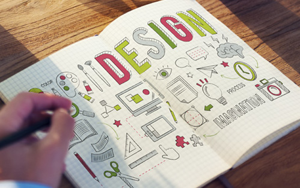
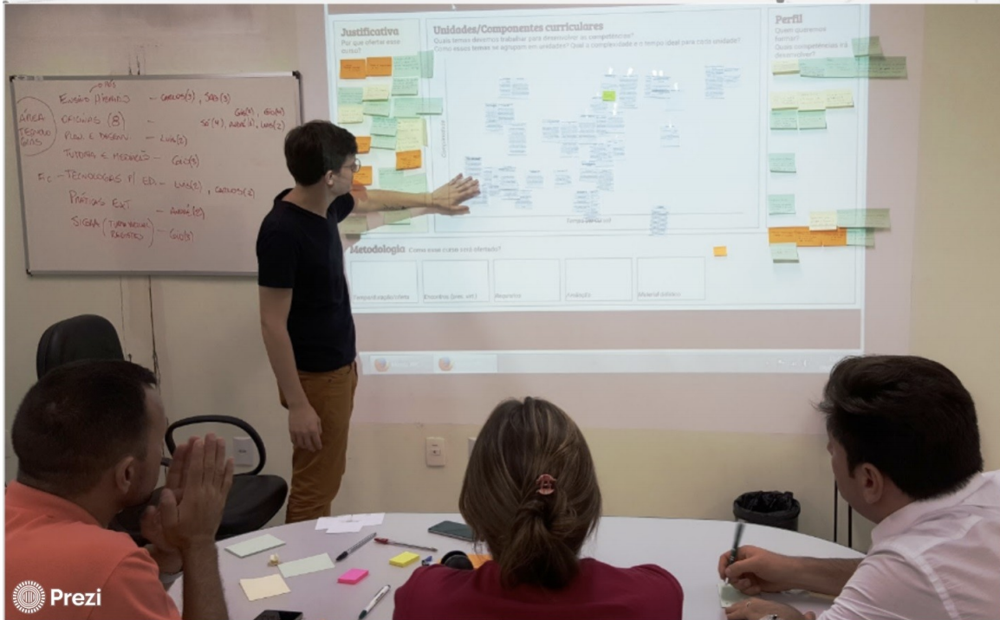
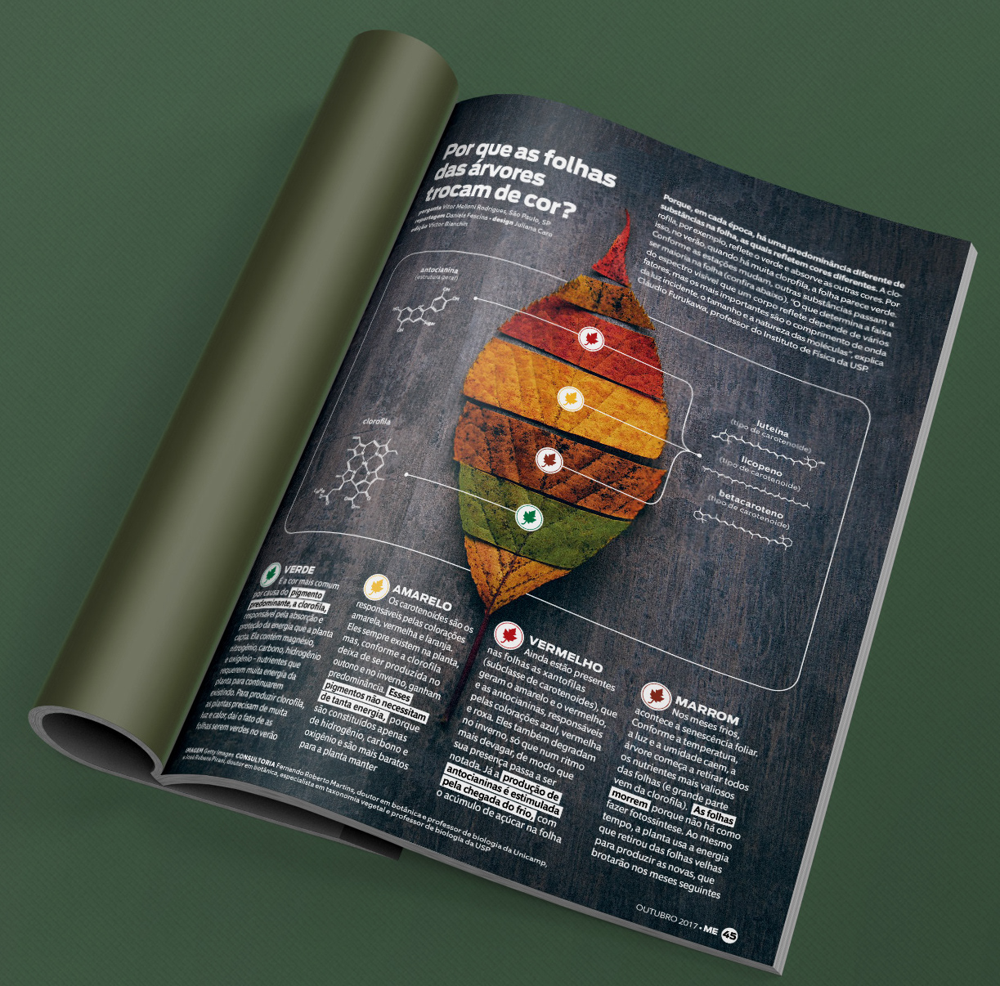

# 2 | Princípios de Design Instrucional



Design instrucional (DI) pode ser entendido como a atividade de desenvolvimento de um conjunto de ações e objetos que atendam determinadas necessidades de aprendizagem (Ozcinar, 2009). Diz-se que sua origem remonta ao período da Segunda Guerra mundial, na qual uma equipe de psicólogos e outros profissionais buscou desenvolver métodos e materiais instrucionais para formação rápida dos milhares de soldados recrutados na época.

De lá pra cá muita coisa mudou. Avanços nas teorias de aprendizagem, nas tecnologias de informação e comunicação e na Educação como um todo ampliaram o entendimento sobre o que é Design Instrucional. À propósito, o próprio termo "instrucional", que vem do inglês "instructional", vai além da noção de instrução como um conjunto de orientações para operar uma máquina, por exemplo. Nesse contexto, o termo "instrucional" remete à ideia de planejamento, de uma sequência sistemática de conteúdos e atividades com o objetivo de construir o conhecimento, desenvolver competências, de aprender (SILVA, 2013).

```{admonition} Design Instrucional ou Design Educacional?

O conceito de Design Educacional costuma aparecer para representar um trabalho mais amplo, por exemplo, o projeto de um curso. Já o Design Instrucional seria em nível menor, por exemplo de um material didático específico, como uma videoaula. Todavia, grande parte dos autores que pesquisam a área entendem o Design Instrucional como uma atividade ampla, que também inclui planejamento de cursos e projetos em nível institucional. Além disso, o termo Design Instrucional é mais comum nos diversos meios que tratam do tema ([Clique aqui](https://trends.google.com.br/home) e veja um comparativo do número de buscas no Google). Nesse sentido, nesta unidade curricular, trataremos Design Instrucional e Design Educacional como sinônimos.
```

Um dos nomes que despontam no Brasil quando se trata de Design Instrucional (DI) é Andrea Filatro. A autora, que publicou diferentes livros sobre DI e participa regularmente de eventos e cursos, afirma que o Design Instrucional é uma ação intencional e sistemática que envolve o planejamento, o desenvolvimento e a utilização de métodos, técnicas para elaboração de materiais e recursos educacionais em situações didáticas a fim de promover a aprendizagem (FILATRO, 2008).

O vídeo que segue é um webinário recente sobre o tema, no qual a autora resgata alguns conceitos básicos e apresenta práticas inovadoras no design instrucional. Assista ao vídeo e, em seguida, compartilhe suas percepções com os colegas, [clicando aqui!]()

<iframe width="560" height="315" src="https://www.youtube.com/embed/NDqixn8jU_0" title="YouTube video player" frameborder="0" allow="accelerometer; autoplay; clipboard-write; encrypted-media; gyroscope; picture-in-picture" allowfullscreen></iframe>


Filatro (2008) também destaca que design instrucional pode acontecer em nível macro e/ou micro. O nível macro implica em gerenciar o projeto, envolvendo a análise dos requisitos de um curso, estratégias institucionais, os objetivos de aprendizagem, possível perfil dos alunos, a avaliação do curso, etc. Já o nível micro está mais centrado na organização e adequação do conteúdo, na criação de recursos educacionais, objetos de aprendizagem que facilitem e qualifiquem o conteúdo disponibilizado ao aluno.

> Nesta unidade curricular de **Produção de Recursos Didáticos**, focaremos no **nível micro**, que se refere à elaboração de materiais. O **nível macro** é trata em outros cursos e unidades voltadas para o **Planejamento de Cursos e Unidades Curriculares**. 

```{admonition} E agora?
Design Instrucional é só para EaD? O design instrucional recebe destaque na Educação a Distância pelo fato de que o bom planejamento do material didático é fundamental nessa modalidade. Além do material, o ambiente virtual, as atividades e a mediação também precisam ser previamente planejadas. Ao se projetar uma solução educacional na modalidade a distância, é preciso prever os possíveis caminhos, os diferentes perfis e estilos de aprendizagem, as possíveis dúvidas e fatores que podem desmotivar o aluno a seguir em frente. Mas não seriam estas, também, preocupações do ensino presencial?
```

## Modelo ADDIE


O modelo de aplicação do Design Instrucional mais difundido e utilizado atualmente (SILVA, 2013) é conhecido como **ADDIE**, acrônimo do inglês para as etapas de:

1. Análise (*Analysis*)
Quem é público-alvo? Quais os objetivos? De onde partem? Qual é o contexto? Quais as limitações e possibilidades? ...

2. Projeto (*Design*)
Qual é a melhor forma de apresentar os conteúdos e atividades para o público-alvo? Que ações podem ser pensadas para que alcancem os objetivos de aprendizagem? Como serão os materiais?

3. Desenvolvimento (*Development*)
Momento de desenvolver as soluções. Elaboração de materiais, atividades, percursos, ambientes, ...

4. Implementação (*Implementation*)
A fase de implementação se refere à aplicação do material/estratégias desenvolvidas. É o curso em andamento. Alunos acessando os materiais, navegando pelo ambiente, etc.

5. Avaliação (Evaluation)
A avaliação é crucial em qualquer processo. As soluções desenvolvidas foram efetivas? O que poder ser melhorado?

Este modelo pode ser aplicado tanto em nível macro, para o desenvolvimento de curso, como em nível micro, para elaboração de algum material didático. Releia as etapas do processo acima pensando inicialmente em um curso e, em seguida, em algum material didático específico. Note que as mesmas questões podem ser aplicadas, uma vez que sem definir os objetivos e compreender o contexto, dificilmente você conseguirá desenvolver uma solução educacional efetiva.

Também é importante destacar que esse modelo apresenta uma lógica linear, mas é possível mesclar essa abordagem com *Design Thinking* ou outras metodologias não lineares, integrando a avaliação ao longo do processo e implementando fases de prototipação, por exemplo. Você pode avaliar continuamente e retornar para etapas anteriores antes de efetivamente implementar a solução para um grande público. 

```{admonition} Aprofunde seus conhecimentos
Existem outros modelos de Design Instrucional, com diferentes pontos de vista. O modelo ARCS, por exemplo, foi criado pelo psicólogo norte americano John Keller ao buscar formas de trabalhar melhor a motivação dos alunos para aprendizagem.

[Conheça outros modelos clicando aqui.](https://moodle.ead.ifsc.edu.br/pluginfile.php/224604/mod_book/chapter/16225/modelagem-modelosDI.pdf)
```

## Elementos de um material didático

O Ministério da Educação (BRASIL, 2007) publicou um documento com [Referenciais de Qualidade para Educação Superior a distância](https://moodle.ead.ifsc.edu.br/pluginfile.php/224604/mod_book/chapter/16226/refead1.pdf), indicando que um material didático de qualidade deve, entre outros fatores,

- atender de forma sistemática e organizada o conteúdo definido no projeto político pedagógico do curso, segundo a ementa, de modo a desenvolver habilidades e competências específicas;  
- detalhar que competências cognitivas, habilidades e atitudes o estudante deverá alcançar ao fim de cada unidade, módulo e disciplina, oferecendo assim a oportunidade sistemática de uma autoavaliação;
- buscar integrar diferentes mídias, explorando a convergência e a integração entre elas na perspectiva da construção do conhecimento e interação entre os múltiplos atores desse processo;
- ser estruturado em linguagem dialógica, de modo a promover um estudo autônomo do estudante e estimular a sua capacidade de organizar e aprender diante de seu ritmo de desenvolvimento;
- indicar bibliografias para buscas complementares à aprendizagem, instigando o próprio estudante a explorar mais cada assunto a partir das suas necessidades.


Uma das formas de incorporar esses indicadores de qualidade é por meio dos chamados elementos instrucionais. Você provavelmente já se deparou com algum material didático que apresentava caixas de destaque, ícones, lembretes, dicas, leituras complementares e outras seções específicas. Tais elementos auxiliam a organizar o conteúdo de forma lógica e atrativa para quem estuda, mas planejar os elementos instrucionais a serem utilizados é ainda mais importante para quem está construindo o material. Por exemplo, ao definir que o material didático terá elementos de destaque, exemplos e reflexões, os autores do material ficam com esses elementos em mente buscando oportunidades de contemplá-los ao longo do material.

Nesse exato momento, estamos aqui escrevendo este material e já pensando que precisamos utilizar um dos nossos elementos instrucionais que é o "Deu certo". Você deve ter visto ele nos materiais das unidades anteriores. É aquela caixa que conta um caso de sucesso, um exemplo real, relacionado ao conteúdo que estamos trabalhando. À propósito, um "Deu certo" do próprio curso cairia bem, hein? Então, aí vai um exemplo da casa pra você:

```{admonition} Deu certo!
A Especialização em Tecnologias para Educação Profissional do Instituto Federal de Santa Catarina foi pensada de forma colaborativa por professores e profissionais de diferentes áreas. Em pelo menos duas das reuniões que fizemos a pauta tratou da estrutura do ambiente virtual, do formato do nosso material didático e dos elementos instrucionais que trabalharíamos. Depois de muitas ideias, chegamos aos seguintes elementos:



- **Vídeo contexto:** todo livro abre com um vídeo contexto que apresenta cerca de 5 fatos instigantes sobre o tema da unidade curricular. O vídeo fecha com uma pergunta chave a ser trabalhada ao longo dos estudos.
- **Você precisa saber:** caixa com ícone de uma bandeirinha indicando materiais de leitura/acesso obrigatório. Esta é uma forma de integrar materiais existentes e que atendam à ementa e ao conteúdo elaborado pelos professores, sem perder a oportunidade/contexto.
- **Amplie seus conhecimentos:** caixa com ícone de rede/conexão indicando materiais de leitura/acesso não obrigatório. Essa é uma forma de recomendar materiais extras para alunos que querem saber mais sobre o assunto, sem perder a oportunidade/contexto.
- **E agora?:** caixa com ícone de astronauta na qual alguma questão problematizadora ou reflexão leva à um tópico de fórum para discussão. A caixa pode ser usada sempre que o conteúdo abrir brecha para uma boa troca de ideias.
- **Conheça e use:** caixa com ícone de varinha mágica para recomendar ferramentas relacionadas ao assunto tratado. Cada ferramenta vem com uma breve descrição e ao final um link para o glossário de tecnologias que é transversal ao curso.
- **Conectando os pontos:** caixa com mesmo ícone do amplie seus conhecimentos que aparece ao final do conteúdo de cada unidade. O objetivo é resgatar alguns pontos tratados e conectá-los com o que o aluno estudará em seguida.

E aí, reconheceu algum desses elementos ao longo dos estudos até aqui? Além deles, foram pensados outros elementos como destaques e listas, que, por consequência, também recebem um tratamento gráfico diferenciado. Os elementos gráficos precisam contribuir com a proposta. Mas, isso é assunto para mais adiante! #semspoiler!
```

Perceba que nós demos uma cara diferente para alguns elementos que já são velhos conhecidos dos materiais didáticos como o "Saiba mais" e o "Recapitulando". Você não precisa utilizar sempre os mesmos elementos. O importante, ao se pensar nos elementos instrucionais de um material didático, é pensar em **quais tipos de informação serão apresentadas**. Terá exemplos? Você explicitará os objetivos de aprendizagem logo no começo? Fará síntese para resgatar o que foi visto até o momento? Destaques? Reflexões? Enfim, há uma série de elementos que podem ser integrados ao material. Todavia, é preciso saber utilizá-los de forma que não sobrecarreguem o material, tanto na carga congnitiva (muito conteúdo) como no peso visual (vulgo carnaval, hehe).  

Além disso, vale destacar que elementos instrucionais, sozinhos, não fazem um bom material. O coração de um bom material está na **linguagem**. É o que você verá a seguir. Vai com fé!



## Linguagem dialógica

Quando tratamos de materiais didáticos, além de considerar o conteúdo e a mídia, é preciso uma atenção especial à forma como nos comunicamos.

Você já leu algum livro ou assistiu a algum vídeo e teve a sensação de que o autor estava sentado ao seu lado, conversando com você? Esse tom de conversa, próximo da linguagem falada e recheado de perguntas que suscitam a reflexão é o que podemos entender como linguagem dialógica.


Na EaD, a gente diz que a educação é a distância, mas não precisa ser distante. A distância aqui é principalmente temporal. O autor de um material didático o produz em um tempo diferente do tempo em que ele será acessado. Veja o nosso caso: Sabrina e eu, Luís, estamos produzindo este material em conjunto. Este trecho, em especial, está sendo escrito por mim, Luís, em um voo de Belo Horizonte para Guarulhos (até agora, turbulências apenas no campo das ideias). Ao produzir o material, ficamos o tempo todo com você em mente e buscamos nos remeter à você. Essa é uma das formas de nos aproximarmos.

Outro ponto relevante da linguagem dialógica é que um diálogo não é um monólogo. Parece óbvio, mas como fazer para ouvir o outro sendo que o autor está em um tempo diferente do leitor? É por isso que além da linguagem próxima, o autor deve promover a reflexão, como se esperasse uma resposta do leitor. (Em alguns casos, é possível prever formas para que o leitor se manifeste. Neste curso, nós criamos tópicos de discussão ao longo do texto que levam a um fórum, por exemplo.)

Não é à toa que a linguagem dialógica é um elemento indicador para qualidade do material didático. Para Freire (2011, p. 47), ensinar “não é transferir conhecimento, mas criar as possibilidades para a sua produção ou a sua construção". Isto significa que além de apresentar o conteúdo de forma agradável, interessante e motivadora, o autor precisa instigar a reflexão-ação.

```{admonition} Destaques da linguagem dialógica
- **Tom de conversa** - procure escrever/falar como se estivesse conversando com o leitor/espectador. Use pronomes de tratamento, como “você", e/ou terceira pessoa “nós". Por exemplo: "Até aqui, vimos que a linguagem é essencial na elaboração de um material didático. No tópico a seguir, você conhecerá uma técnica de narrativas conhecida como *storytelling*".

- **Orientação da leitura/navegação** - receba o leitor com boas-vindas e direcione as ações. Por exemplo: "Veja, no vídeo que segue, a diferença entre linguagem acadêmica e linguagem dialógica." / “Clique no link a seguir e saiba mais." / “Participe da discussão! Acesse o fórum e compartilhe suas ideias."

- **Reflexão** - faça perguntas/desafios em momentos oportunos para que o leitor resgate conhecimentos prévios, relacione o que está vendo com situações reais, questione conceitos, etc. Por exemplo: “Por que será que alguns conteúdos são tão agradáveis, instigantes e de fácil assimilação?"


- **Exemplos/casos** - traga exemplos, comparações, casos que ilustrem e problematizem os conceitos apresentados. Cada leitor terá uma bagagem de experiências e conhecimentos diferentes. Por isso, proponha situações que permitam exercitar, refletir e construir o conhecimento na prática.

```

```{admonition} Cuidados com a linguagem dialógica
- **Informalidade excessiva** - a informalidade e o humor são recursos adequados para promover a proximidade com o leitor, mas é preciso atentar para que eles não prejudiquem a compreensão ou afetem a percepção de relevância de determinado conteúdo.


- **Nível dos leitores** - é preciso estabelecer uma linguagem adequada ao público do material sendo produzido. Um material para especialização, por exemplo, será diferente de um material para crianças. A propósito, no intuito de se aproximar com o leitor adulto, é preciso cuidar para que a linguagem não fique infantil, inclusive a linguagem visual.


- **Pressuposições** - iniciar imaginando que o leitor já sabe algo, por exemplo, “como você já deve saber, o cuidado com a linguagem é crucial para qualidade de um material didático.” Para resolver essa situação, basta suprimir o primeiro trecho. Em contrapartida, você pode certamente resgatar conteúdos já apresentados anteriormente em um mesmo material/curso.


- **Uso excessivo da primeira pessoa do plural ou da terceira pessoa (formal)** - em alguns momentos, é oportuno utilizar a primeira pessoa do plural (nós) no intuito de promover a sensação de proximidade entre autor e leitor. Por exemplo, ao dizer “Até aqui <u>vimos</u> os diferentes tipos de linguagens”. Porém, também é importante lembrar que o leitor é um aprendente ativo no processo e precisa sentir isso por meio de tratamento pessoal. Por exemplo, “No tópico a seguir, <u>você verá</u> alguns princípios de design gráfico.” Veja que é diferente de dizer “No tópico a seguir, <u>veremos</u> alguns princípios do design gráfico.” Normalmente, se pondera em quais momentos se espera uma ação do leitor e, assim, utiliza-se uma fala direta ("você"), e, em quais momentos espera-se promover a sensação de que leitor e autor farão algo juntos (usando o "nós"). Além disso, há também o uso de terceira pessoa e da impessoalidade, que é comum em artigos acadêmicos nos quais buscamos passar credibilidade científica. Por exemplo, se disséssemos "No tópico a seguir, <u>serão apresentados</u> alguns princípios de design gráfico." Note como fica distante.

Ah! Uma dica: por mais que você esteja produzindo um material para diversas pessoas, na maior parte dos casos, soa mais próximo dizer “você” em vez de “vocês”. ;)
```

```{admonition} Você precisa saber
Considerando o que você já estudou até aqui sobre Design Instrucional e Linguagem dialógica, indicamos a leitura do artigo Produção de conteúdos para EaD: planejamento, execução e avaliação, disponível na sequência. Os autores fazem uma retomada de alguns conceitos, em especial acerca da linguagem dialógica instrucional.

 [Clique aqui para ler](https://moodle.ead.ifsc.edu.br/pluginfile.php/224604/mod_book/chapter/16227/volume_2_artigo_203.pdf)
```

