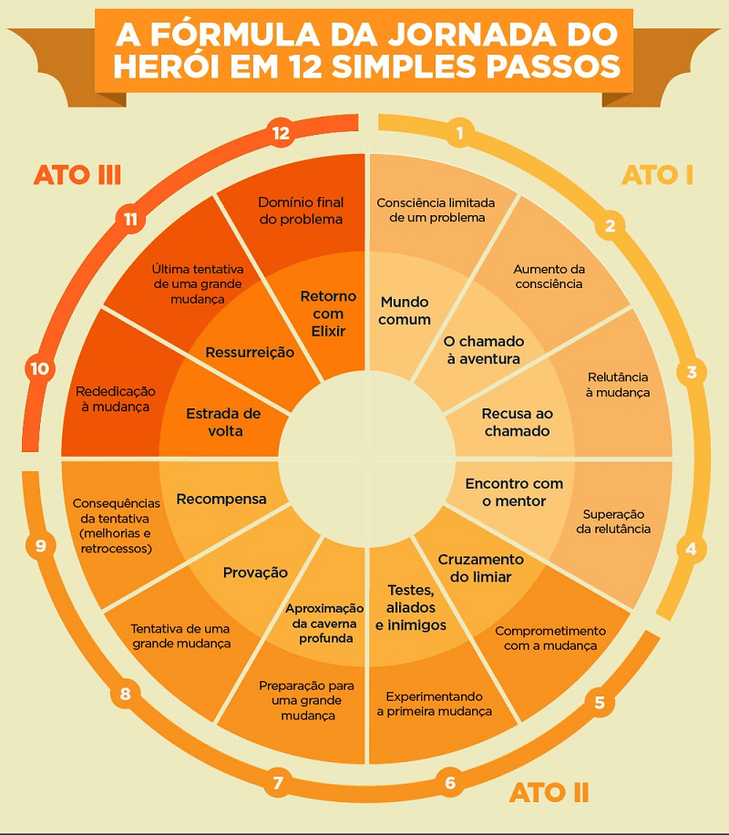

# 3 | Roteirização

Quando falamos em produção de um recurso educacional o roteiro é peça-chave para implementar uma boa estratégia de comunicação e engajar os públicos envolvidos.

Um roteiro é um plano. Um documento que orienta como algo será feito.

Façamos um paralelo com roteiro de viagem. Ao planejar uma viagem, costumamos começar listando os lugares que queremos visitar, as coisas que queremos fazer, comprar e comer. A organização da sequência de visitação desses lugares obedece uma sequência lógica, geralmente de deslocamento físico. Não faria muito sentido ir para o norte, depois para o sul, depois voltar para o norte. Mas quando os lugares para se visitar são próximos, o roteiro pode seguir outras lógicas: interesse, datas especiais, quantidade de pessoas, entre outros. Além da sequência que segue uma lógica, o roteiro também prevê os tempos e distâncias para cada atividade. As vezes não é possível visitar três museus no mesmo dia.  Por fim, um bom roteiro de viagem prevê também paradas para descanso e momentos livres para atividades não planejadas.

Note que um roteiro estabelece objetivos, marcos de parada, atividades, trajetos e tempos. Um roteiro de material educacional não será lá muito diferente. Principalmente se você considerar que o material a ser estudado será uma jornada por um conjunto de saberes e reflexões. O leitor (entenda leitor não apenas de texto, mas leitor para qualquer gênero textual ou não), partirá de um lugar e será guiado pelo material. Essa navegação poderá ser **linear** e **não linear**. O material que você está lendo, neste momento, por exemplo, segue uma lógica linear. Por mais que existam links que permitem que você navegue pelos capítulos de forma não linear, a sequência de apresentação sugere uma linearidade. Esta é uma estratégia adotada para este curso. Mas poderíamos, por exemplo, ter módulos independentes que apareceriam seguindo outra lógica, talvez a de interesse ou de necessidade de aprendizagem. Essa lógica **não linear** é comum em plataformas adaptativas. Dependendo dos dados captados pelo sistema sobre você, seja por um questionário, uma avaliação diagnóstica ou sua própria navegação, a plataforma pode lhe recomendar marcos/atividades totalmente personalizados para o seu perfil. É como se o sistema fosse um guia de turismo pessoal lhe indicando as melhores opções a cada passo que você dá. 

Bom, para fins de compreensão de roteiros para material didático, vamos manter o foco nos roteiros que tendem à linearidade, como livros físicos e digitais, ebooks interativos, vídeos, podcasts e apresentações de slides. Dois pensamentos cruciais em relação ao roteiro:

- o formato do roteiro estará totalmente relacionado com a mídia  – um roteiro de *ebook* é diferente de um roteiro de vídeo, visto que os elementos de cada mídia mudam;
- a complexidade do roteiro dependerá de quem produzirá o material – se você está planejando o material, mas não será o responsável pela sua produção, o roteiro precisa ser muito bem detalhado. Mas se você mesmo produzir o material, um esboço já pode ser suficiente para guiar a execução.


Veja, na imagem que segue, um exemplo com trecho de roteiro de apostila em comparativo com resultado final. Nesse caso, o texto continha indicações para o responsável pela produção (a diagramação e ilustração, aqui, foram feitas por outro profissional).

<iframe src="https://h5p.org/h5p/embed/283481" width="719" height="457" frameborder="0" allowfullscreen="allowfullscreen" allow="geolocation *; microphone *; camera *; midi *; encrypted-media *" title="Roteiro x Resultado 1"></iframe><script src="https://h5p.org/sites/all/modules/h5p/library/js/h5p-resizer.js" charset="UTF-8"></script>

[Clique aqui e veja mais exemplos de roteiro e resultado nesse mesmo material.](https://moodle.ead.ifsc.edu.br/mod/page/view.php?id=82432)

Lembra dos elementos instrucionais que você estudou no tópico anterior? Eles podem ser definidos antes do roteiro ou ideias de elementos podem surgir ao longo do roteiro. Em todo caso, é interessante manter um padrão entre eles.

**Mas, afinal, como eu faço o roteiro?**

Vamos supor que trocamos algumas ideias considerando o conteúdo e o perfil do público e definimos que o material deve ter: exemplos e casos reais, questões de reflexão, momentos de síntese, conteúdos complementares e sugestões de atividades práticas. Agora um tema... que tal tipos de massas? Massa de comer mesmo! Veja como o material poder ser diverso:

- **Ideia do roteiro 1**
  
  Iniciar apresentando os objetivos de aprendizagem / introdução com a história breve das massas até os dias de hoje / levantar alguma questão sobre por que existem diferentes tipos de massa (pode levar a um fórum) / explicar a diferença entre massas recheadas e não recheadas (inserir um esquema ou infográfico) / apresentar uma receita com exemplo de preparo de massa / sugerir que o aluno tente fazer a massa em casa / fazer uma síntese dos tipos de massa / indicar um conteúdo extra que relaciona massas, molhos e vinhos.

- **Ideia do roteiro 2**

  Começar com uma situação problema, uma história de um casal que irá receber os amigos para jantar / levantar alguma questão sobre qual tipo de massa seria mais interessante / apresentar os objetivos de aprendizagem / apresentar os diferentes tipos de massa e curiosidades sobre sua história / voltar pra história e criar uma situação problema na qual os personagens não sabem fazer a massa que escolheram / sugerir uma atividade prática de pesquisa e execução de uma receita / voltar para história já no momento do jantar, na qual os personagens contam para os convidados a saga do jantar, resumindo os tipos de massa / um dos personagens levanta a questão sobre qual vinho eles querem beber / gancho para conteúdo complementar sobre combinação de massas, molhos e vinhos. 

- **Ideia do roteiro 3**

  Iniciar com uma pergunta problema sobre a diferença nos tipos de massa / apresentar os objetivos de aprendizagem / trazer a fala de algum especialista sobre os tipos de massa / apresentar o caso de um restaurante de massas e quais as preferidas dos clientes / mostrar a receita de uma das massas / propor uma atividade síntese de relacionar imagens dos tipos massa com os nomes corretos / convidar o aluno para que pratique executando alguma receita / sugerir um conteúdo extra sobre combinação de vinhos e massas.

Note que as três ideias apresentam sequências e elementos diferentes, mas todas trabalham para levar o estudante/leitor a atingir um objetivo de aprendizagem que é saber diferenciar os tipos de massa. Observe, também, que não foi indicada a mídia para cada ideia de roteiro. Se quiser, leia novamente cada ideia e imagine como ela seria em formato de uma apostila impressa, um vídeo ou recurso interativo. Dependendo da mídia, o roteiro precisa agora ser desdobrado para detalhar os aspectos necessários (assim como você exercitou no caso do roteiro de vídeo).

```{admonition} Aprofunde seus conhecimentos
A produção de um recurso educacional pode ser feita por você mesmo ou por uma equipe especializada. Todavia, cada vez mais surgem ferramentas de autoria mais completas e fáceis de usar que promovem a autonomia nessa criação. Algumas dessas ferramentas são gratuitas e outras pagas. Você verá um melhor esse assunto no Capítulo 6. Até lá, que tal ver esse material sobre roteiro de cursos online? Ele contempla alguns dos elementos que vimos até aqui. Ah! Observe que o recurso utilizado se trata de um material que costumamos chamar de "tela e tela". É um recurso interessante para conteúdos mais curtos e rápidos, visto que pode cansar pelo excesso de cliques.   

[Como criar roteiros para cursos online.](https://www.mobiliza.com.br/acervo/curso-roteiros-para-ead/)

```

## Storytelling

Não é raro encontrarmos histórias, casos e exemplos ao longo dos materiais didáticos. Sejam eles textos, vídeos, áudios, jogos ou outros recursos interativos, as histórias nos ajudam a contextualizar o que está sendo estudado. 

Contar histórias ou *storytelling*, à propósito, é uma das formas mais antigas de repassar o conhecimento entre gerações. Histórias envolvem, ilustram e nos fazem refletir. Integrar histórias no seu material didático poder ser uma excelente opção. E para isso existem diversas técnicas (técnicas de *storytelling*). 

Histórias, mitos, livros e filmes já foram estudados a fim de tentar identificar padrões de narrativa que estejam relacionados com o interesse e a atenção do público. Algumas destas formas de contar histórias são apresentadas no vídeo que segue. Confira!

<iframe width="560" height="315" src="https://www.youtube.com/embed/360y-AwaLK4" title="YouTube video player" frameborder="0" allow="accelerometer; autoplay; clipboard-write; encrypted-media; gyroscope; picture-in-picture" allowfullscreen></iframe>

Dentre as apresentadas, a mais conhecida é a Jornada do Herói. Uma análise feita por Joseph Campbell que indica alguns passos comuns em histórias de sucesso. Veja no infográfico a seguir.



Um elemento que merece atenção em todas as histórias é que elas são feitas de altos e baixos. Quando você pensa que está tudo bem, algo acontece. Essa oscilação cria uma dinâmica na narrativa, que, associada de elementos desconhecidos que geram curiosidade, mantém a atenção do leitor/espectador.

É por isso que além de servir para criação e contação de histórias, os elementos do storytelling servem também de inspiração para construção do seu recurso didático. Veja algumas ideias:

- **Promover altos e baixos**: isso significa quebrar a constante. Se o conteúdo vem numa sequência de afirmativas que se complementa, que tal inserir um contra-ponto? Um questionamento sobre tudo que foi visto até o momento.

- **Instigar a curiosidade**: sabe aquela cena de uma porta entreaberta no final do corredor que você não quer que o personagem vá ver, mas ao mesmo tempo está morrendo de curiosidade pra saber o que tem lá? Instigar a curiosidade é instigar a ação.

- **Explicitar a mudança**: histórias geralmente apresentam um estado final bem diferente do inicial. Permitir que o leitor perceba que ele não é mais o mesmo depois da jornada facilita a percepção de valor no processo.

- **Histórias paralelas**: além da narrativa central, pode haver narrativas paralelas que enriquecem o contexto. No seu material, você pode promover o mesmo fornecendo elementos extras que ampliam os horizontes da jornada.

E aí, o que mais você percebe de interessante nas técnicas de contação de histórias que podem ser aproveitadas em recursos didáticos? [Compartilhe aqui conosco!]()


